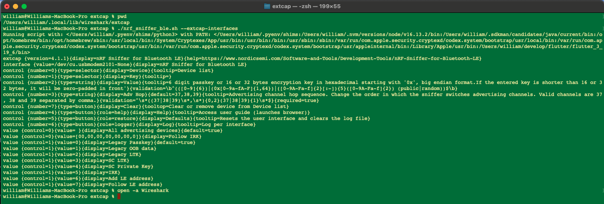
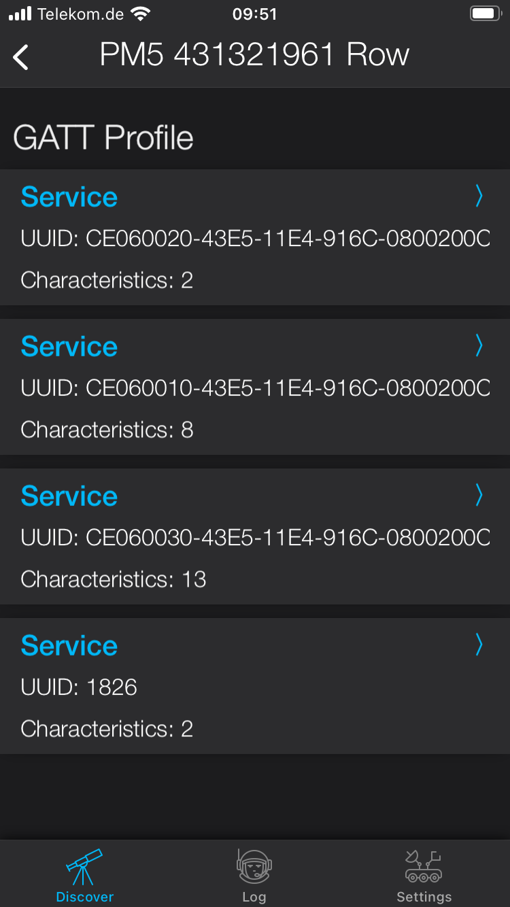
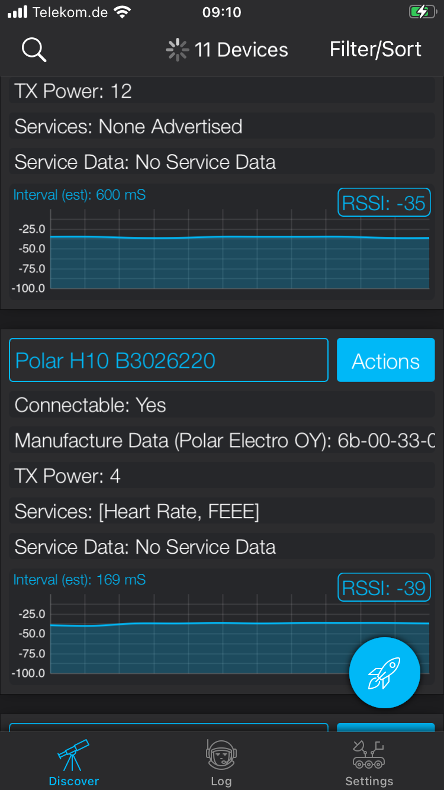
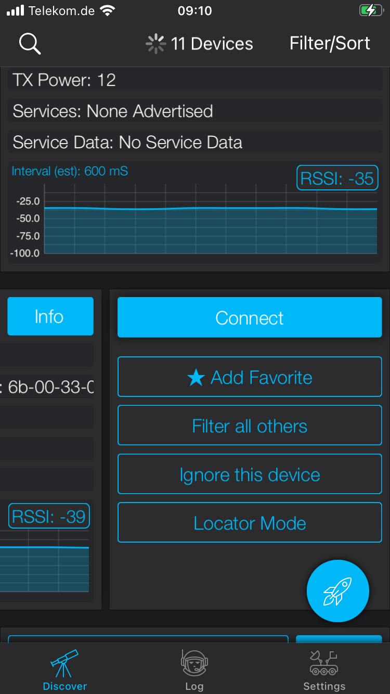
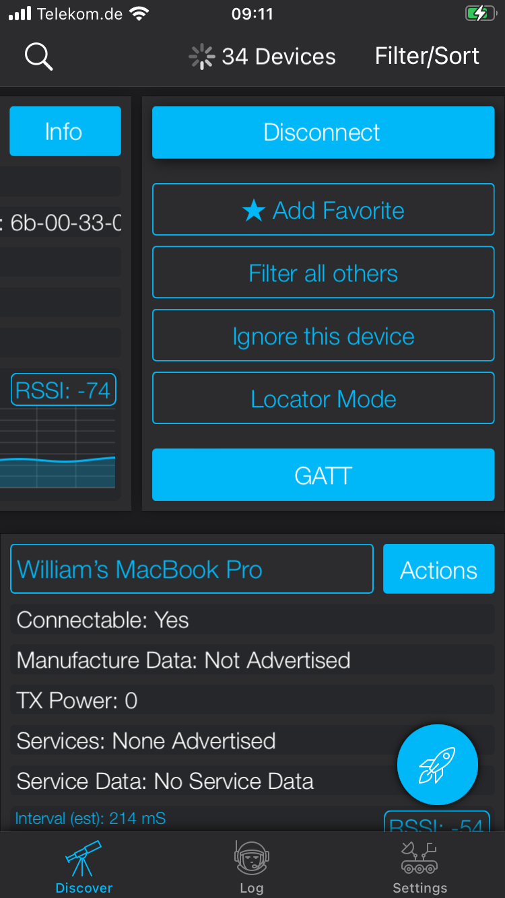
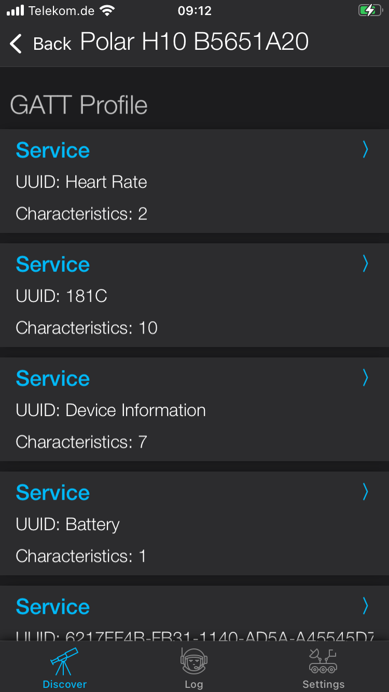
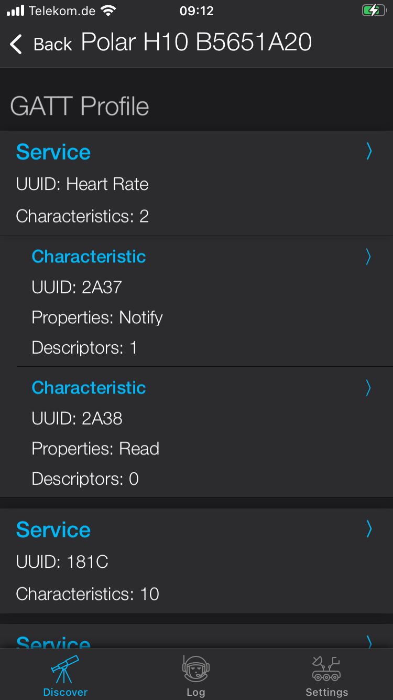
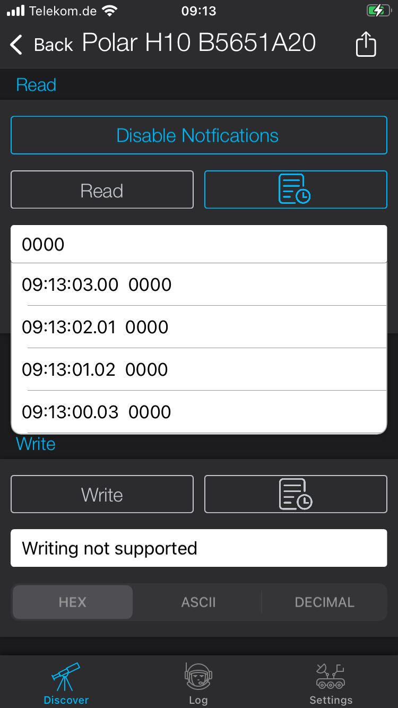
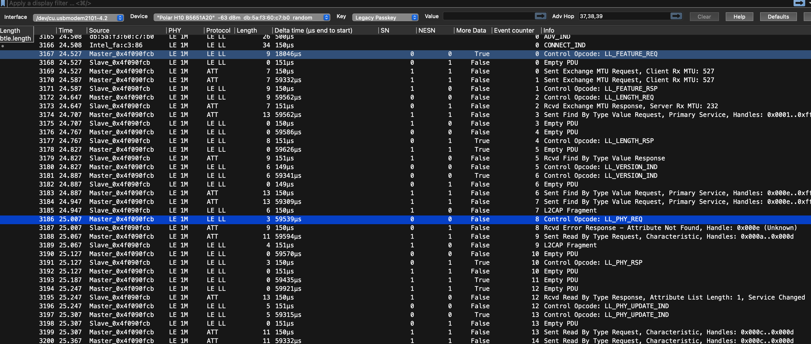
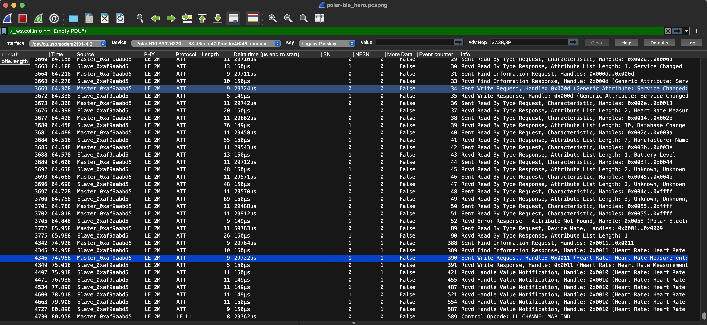

# Using Wireshark with Nordic nRF52840 Dongle to sniff Polar 10 HRM

## Wireshark on macOS
### prerequisites:
    1. dongle is programmed as described in nRF52840_Dongle_User_Guide_v2.1.1.pdf
    2. sniffer is install as described in nRF_Sniffer_BLE_UG_v4.1.x.pdf
        This includes sections:
            3.2 Installing Wireshark on Windows and macOS
            3.4 Installing the nRF Sniffer capture tool

### tip:
    Start Wireshark from with installation folder described above in step 2.
    e.g. Installation folder: 

$HOME/.local/lib/wireshark/extcap>./nrf_sniffer_ble.sh --extcap-interfaces
$HOME/.local/lib/wireshark/extcap>open -a Wireshark

## BLE client (central/master)
For an easy BLE client, use the app BLE Hero. 
Find, connect and subscribe to Heart Rate service's 0x2a37 characteristic as show in screenshots below

<table>
<tr>

</tr>
<tr>

</tr>
</table>
       
## The peripheral in this how-to is the Polar H10 Heart Rate Monitor

## Wireshark session screenshots
### BLE master in c++/winrt application (Here I forget to subscribe)

### BLE Hero (good working example)
One can see notification being delivered to master at bottom of screenshot
