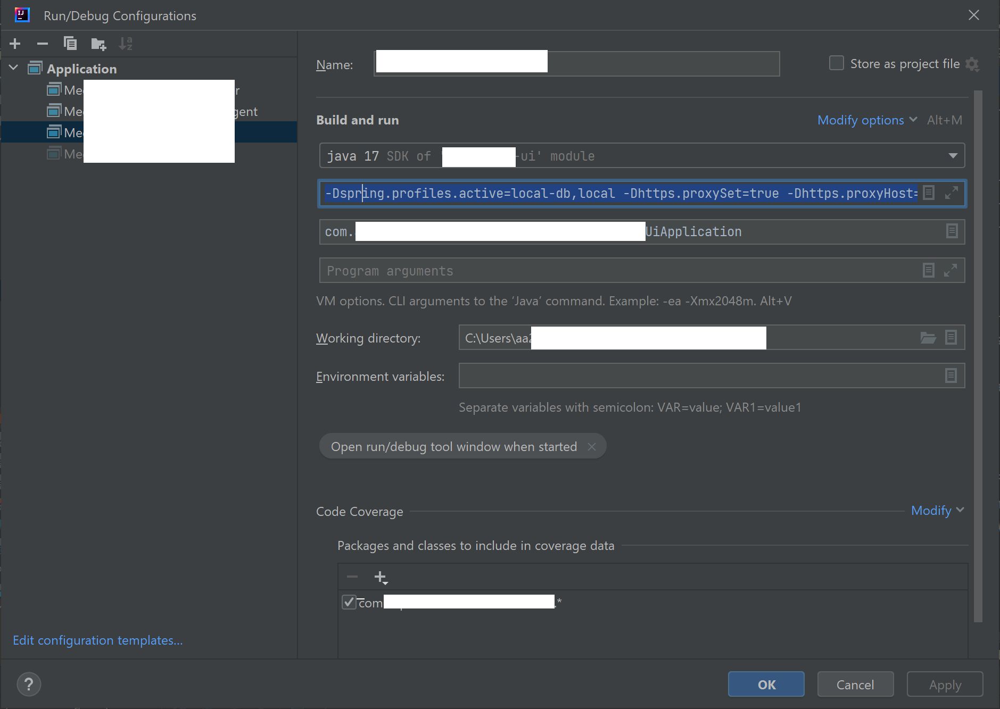
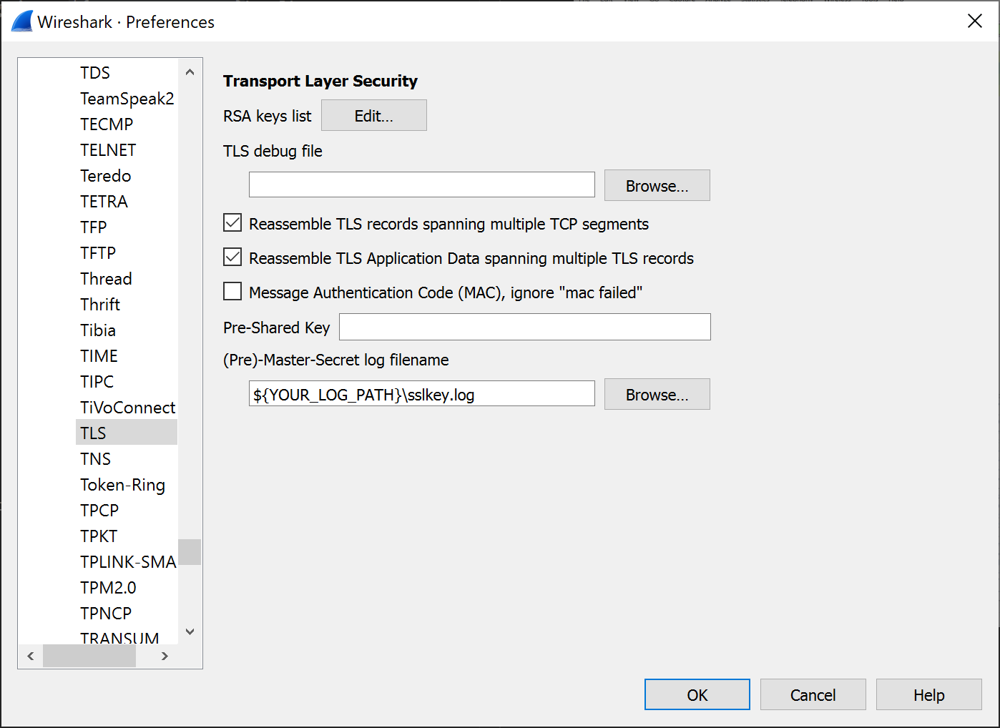
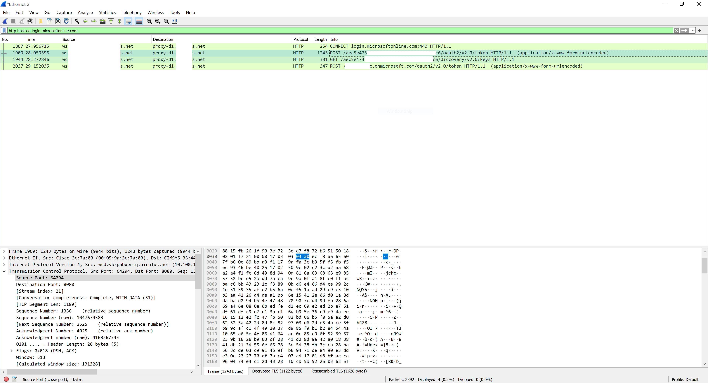
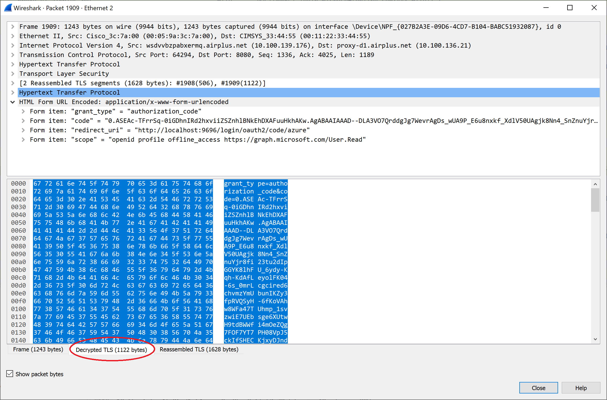

# How-to decrypt TLS traffic of a Java application running on localhost behind a proxy server with wireshark

The situation was that I had a Java web application running with Java 17 locally and I wanted to debug the backend calls being made by the application. 

Essentially there are a [few good articles](https://weinan.io/2021/08/25/Using-Wireshark-And-jSSLKeyLog-To-Capture-The-Java-SSL-Network-Packets.html), also [this one](https://www.comparitech.com/net-admin/decrypt-ssl-with-wireshark/#Using_a_pre-master_secret_key_to_decrypt_SSL_and_TLS), about this; however, they are for Java 11 and prior versions. 

The core of the solution is a [javagent](https://www.baeldung.com/java-instrumentation), kindly made avaiable by [schierlm in his jsslkeylog repo](https://github.com/jsslkeylog/jsslkeylog) at github. A description is available [here](https://jsslkeylog.github.io).

At the time of writing this how-to, it was necessary to clone the repo and build it because the latest release of the javaagent [v1.3.0](https://github.com/jsslkeylog/jsslkeylog/releases/tag/v1.3.0) only supported upto Java 15 and a release of the latest changes has not been made. I have added an unofficial [build](https://github.com/jsslkeylog/jsslkeylog/commit/0b74334e47b5c5ca80de6addd88e3e0d4cdb6469) of the changes [here](jSSLKeyLog.jar).

The next thing to do is start the Java application, here in Intellij, with the correct JVM parameters. Here I am assuming that your build produced a jar called: jSSLKeyLog.jar.

```
-Dhttps.proxySet=true 
-Dhttps.proxyHost=${YOUR_HOST}
-Dhttps.proxyPort=${YOUR_PORT}
-Dhttps.nonProxyHosts=${YOUR_NON_PROXY_HOSTS} 
-javaagent:${YOUR_JAR_PATH}\jSSLKeyLog.jar==${YOUR_LOG_PATH}\sslkey.log
```


In wireshark go to: Edit->Preferences->Protocols->TLS and set the (Pre)-Master-Secret log filename to the one in the JVM settings



After recording some traffic, I applied a filter to see http request going to a particular site, here login.microsoftonline.com. 



Choose one of the lines and using the context menu: Follow->TCP Stream. The will show the TLS handshakes as well as the HTTP communication. 



